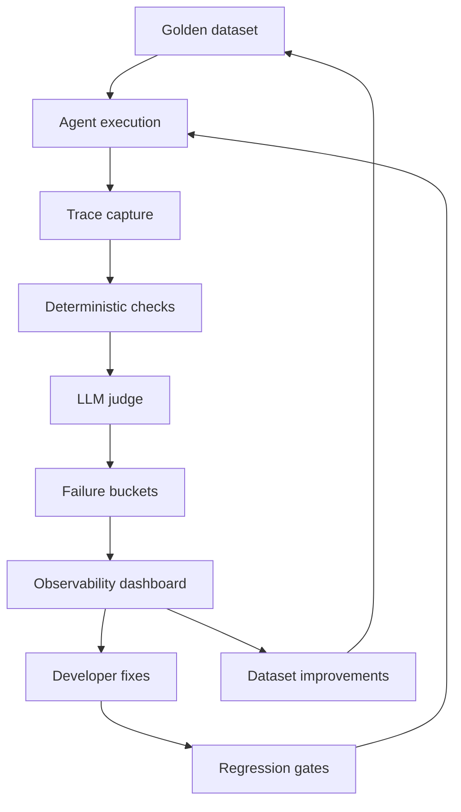

I used to think evaluation was mostly about one question: did the model get the right answer?

That framing breaks quickly once you move from a single LLM call to a production agent.

In an agentic system, a final answer can look correct while the underlying behavior is unsafe, brittle, or impossible to trust. The agent may skip a required human review, call the wrong tool, use the right tool with the wrong arguments, retrieve the wrong evidence, or reach the answer through a path that should not be allowed in production.

That is the uncomfortable part of agent evaluation: correctness is not just about the answer. It is also about the route.

## The Problem With Final-Answer Evals

Most early evaluation setups are built around input-output pairs:

- User query
- Expected answer
- Model answer
- Pass or fail

This works for simple tasks. It is also easy to explain, easy to score, and easy to put into a dashboard.

But once the system has retrieval, extraction, tools, routing, policy checks, human-in-the-loop escalation, and multi-step workflows, final-answer scoring starts hiding the real failure modes.

A production agent can fail in several ways before the final response is even generated:

- It retrieves the wrong contract clause or misses the relevant document section.
- It extracts the wrong field, date, party, obligation, or condition.
- It routes the query to the wrong skill or pipeline.
- It calls a tool that should not have been used for that request.
- It avoids HITL when the task is ambiguous or risky.
- It triggers HITL too often and makes the workflow unusable.
- It produces the right-looking answer from the wrong evidence.
- It gets lucky on one example but follows a path that will not generalize.

The final answer can be correct and the agent can still be wrong.

## What I Learned Building Agentic Eval

In my work on agentic evaluation for legal AI systems, the goal was not only to decide whether an output was correct. The goal was to make failures useful.

That changed the design of the evaluation system.

Instead of treating every failed row as a generic miss, the eval had to explain what kind of miss it was:

- Was retrieval weak?
- Was extraction wrong?
- Did the agent choose the wrong tool?
- Did it use the right tool incorrectly?
- Did it skip a required human review?
- Did it take a random path that happened to produce a plausible answer?
- Did it refuse correctly because the request was outside supported behavior?
- Did the eval itself fail because the benchmark expected the wrong thing?

This is where agentic eval becomes less like a leaderboard and more like engineering infrastructure.

## Outcome Correctness Is Only One Layer

The first layer is still outcome correctness. You need to know whether the final answer matches user intent.

But in production, this layer should not stand alone.

For a legal or contract AI system, the answer has to be grounded in the right document, the right clause, the right metadata, and the right workflow constraints. If the model answers from incomplete evidence, the answer is not reliable even when it sounds fluent.

This is why I think of final-answer evaluation as the last check, not the whole check.

## Tool-Use Correctness

Agents often look intelligent because they can call tools. But tool use creates a new evaluation surface.

The eval should ask:

- Did the agent call the right tool?
- Did it call the tool at the right time?
- Were the arguments valid?
- Did the tool output support the next step?
- Did the agent ignore a tool result it should have used?
- Did it call unnecessary tools to arrive at the answer?

This matters because tool misuse is often invisible in the final response. A user sees a clean answer. The system trace shows whether that answer was produced through a dependable workflow.

## HITL Is Also Something To Evaluate

Human-in-the-loop is often discussed as a safety feature, but in practice it has to be evaluated like any other agent behavior.

An agent should escalate when the situation requires human judgment. It should not escalate just because the prompt is slightly unfamiliar.

So the eval needs to capture both sides:

- Did the agent trigger HITL when uncertainty, ambiguity, risk, or policy required it?
- Did the agent avoid unnecessary HITL when the task could be safely handled automatically?

This is a subtle metric because it is not just accuracy. It is judgment under constraints.

For enterprise systems, especially in legal, finance, insurance, healthcare, or compliance-heavy workflows, this can be as important as the final answer itself.

## Path Correctness: The Part Most Evals Miss

One of the most important lessons for me was that a correct answer from the wrong path is not always acceptable.

In production, agents do not just need to answer. They need to follow an allowed workflow.

For example:

- A document question should use the relevant evidence, not a memorized or guessed answer.
- A structured query should use supported metadata fields, not hallucinated schema.
- A chart or aggregation request should only proceed if the field supports that operation.
- A risky or ambiguous task should pass through the right review step.
- A refusal should be counted as correct when the system cannot safely fulfill the request.

This means evaluation needs to inspect the trajectory, not only the final message.

The question becomes: did the agent arrive at the answer through a path we would trust if this happened thousands of times in production?

## Valid Refusals Should Be First-Class Outcomes

Not every successful agent interaction ends with a direct answer.

Sometimes the correct behavior is refusal:

- The requested field is unsupported.
- The document does not contain enough evidence.
- The requested operation is not allowed.
- The query is outside the product boundary.
- The agent needs human review before continuing.

If the benchmark treats every refusal as a failure, it teaches the wrong behavior. The agent learns to always answer, even when answering is unsafe.

Good evaluation should separate bad refusal from valid refusal.

## Stage-Level Observability

Once an agent has multiple stages, the eval system needs observability at every stage.

For an extraction or document intelligence pipeline, I would want to inspect:

- Input quality
- Retrieval results
- Reranking or filtering
- Extracted entities and fields
- Tool calls
- Intermediate reasoning or planning
- HITL decision
- Final response
- Judge result
- Failure category

Without this, every failed benchmark row becomes a debugging exercise from scratch.

With this, failures become searchable, bucketed, and actionable.

## LLM-as-Judge Is Useful, But Not Enough

LLM judges are helpful when the output is open-ended, when gold labels are incomplete, or when the expected behavior is too nuanced for exact matching.

But I would not make the judge the only source of truth.

A stronger setup combines:

- Deterministic checks for schema, metadata, tool arguments, and exact constraints
- Gold labels where they exist
- Structural alignment when output format matters
- LLM-as-judge for semantic quality and trajectory reasoning
- Human override or review for ambiguous cases
- Re-judging stored runs when the evaluation rules improve

This hybrid approach keeps evaluation flexible without turning it into vibes.

## Failure Bucketing Is The Feedback Loop

The most useful eval system is not the one that says "failed."

It is the one that says:

- Failed because retrieval missed the supporting evidence.
- Failed because the agent used a hallucinated field.
- Failed because HITL was skipped.
- Failed because the tool call was correct but the synthesis was wrong.
- Failed because the benchmark expected an invalid behavior.
- Failed because this was actually a valid refusal.

This is what makes the system useful for developers.

The output of evaluation should become the input to improvement:

- New golden dataset examples
- New edge cases
- Better rubrics
- Better tool specs
- Better retrieval training data
- Better regression gates
- Better product constraints

## How I Would Design A Production Agentic Eval Stack

At a high level, my preferred architecture looks like this:

The core loop is simple: run the agent, capture the behavior, score the outcome and the path, bucket the failure, and feed that back into datasets and engineering fixes.

## Benchmarks Are Not The Product

Public benchmarks are useful because they give us shared language.

AgentBench, WebArena, SWE-bench, OSWorld, GAIA, ToolBench, and tau-bench all show different ways to measure agents beyond static question answering.

But for a real product, the most important benchmark is usually private:

- Your users
- Your workflows
- Your tools
- Your policies
- Your failure modes
- Your acceptable risk boundary

That is why benchmark design is product work as much as ML work.

## Closing Thought

My current view is that agentic evaluation is not a one-time scoring layer. It is a reliability system.

A good eval stack should tell you whether the agent answered correctly, whether it behaved correctly, whether it followed a trusted path, whether it escalated at the right time, and what needs to improve next.

For production AI agents, that is the difference between a demo that works and a system you can keep improving.

