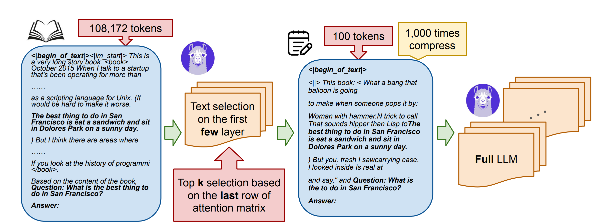
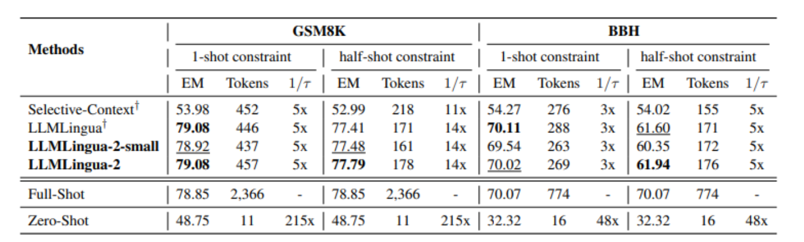

With this blog I have started a journey findings techniques to make llms more effcient and the first topic which i want to discuss is Prompt Compression. Prompt compression is a technique to shorten the input text (prompt) given to large language models (LLMs) while keeping the essential information intact. This helps LLMs process the prompt faster, reducing the time it takes to generate responses. Long prompts have several  challenges in natural language processing applications, such as slower inference, increased computation cost, and a negative , impact on user experience. Additionally, the context length, limit restricts model performance and application scenarios, so this creates a strong demand for reducing prompt length. 

---
## Introduction
Long prompts introduce several challenges for example the processing time for LLMs scales with prompt length, as each token requires computational resources for attention mechanisms and generation. This can lead to delays, particularly in high-volume or real-time scenarios. Moreover, Token-based pricing models mean longer prompts increase operational expenses, which can be prohibitive for small businesses or research projects.
So in the light of above challanges the concept of compressing the input prompt was introduced. Prompt compression involves reducing the length of the input prompt given to an LLM while retaining essential information necessary for generating accurate and relevant responses. Given the computational intensity of LLMs, particularly with long contexts, prompt compression is vital for:

  - *Faster Inference:* Reducing prompt length decreases processing time, which is essential for real-time applications like chatbots, virtual assistants, and customer support systems.

  - *Cost Efficiency:* Many LLM services, such as those provided by OpenAI or Anthropic, charge based on token count. Compressing prompts lowers these costs, making LLMs more accessible for businesses and developers.

  - *Context Window Management:* LLMs have a maximum token limit (e.g., 128,000 tokens for some models), and exceeding this can truncate important information, reducing output quality. Compression allows fitting more context within these limits.

## How Does It Work? 
There are two main approaches:
  - **Hard Prompt Methods:** These modify the text directly, like removing less important words or sentences. At the prompt development level itself few phrases words (for example stop words )could be identified and removed based on the their redundancy. Similarly un-important tokens could be removed. For example, LLMLingua[1] uses a smaller model to cut out unnecessary tokens, achieving up to 20x compression with little performance loss. And Techniques Like GemFilter[2]which uses partial llm (a part of LLM) to identify redundant tokens in the input prompt and after removing the less relavent tokens it uses the compressed prompt for further generation of output.
  - **Soft Prompt Methods:** Soft prompt methods represent the prompt in a compact, non-textual form, often using embeddings or special tokens, which the LLM can interpret. These methods typically offer higher compression ratios but may require additional training or integration. These technieus represent the prompt in a compact form, like special tokens. For instance, 500xCompressor[3] can shrink 500 tokens into one, achieving up to 480x compression, and SelfCP uses the LLM itself to create virtual tokens, compressing to 1/12th the original size.

Each method has trade-offs, and the choice depends on your needs, like how much compression you need versus how easy it is to implement.

credit : Authors of GemFilter

Current users of llm are of two types ,one who have access to llm weights  and can tweak the llm as per requirements and other are the users of closed source llms such as GPTs who are using apis for meet their llm based needs. I will be discussing few methods for both type of scenarios.

## You Don't Have Access To Actual Model Weights
There are users who are using closed source models such as GPT, Sonnet etc where the users don't have access to the model weights, so the approaches like **LLMLingua2** are suitable for those. 

LLMLingua-2 employs a data distillation procedure, which involves extracting knowledge from an LLM (GPT-4) to compress texts without losing crucial information or introducing hallucinated content.A Prompt compression dataset is prepared using using GPT4 which is then used for finetuning a smaller model for the prompt compression.The authors formulate prompt compression as a token classification problem to guarantee the faithfulness of the compressed prompt to the original one, and use a Transformer encoder as the base architecture to capture all essential information for prompt compression from the full bidirectional context. This approach leads to lower latency by explicitly learning the compression objective with smaller models such as XLM-RoBERTa-large and mBERT.
LLMLingua-2 is very easy to use and the finetuned token classification models is well generalized accross various domains and task. For example Here are its Benchmarks on the popular datasets like BBH and GSM8k

*Using LLMLingua is Quite Easy* 
Following a Snippit which can be used 
```python
from llmlingua import PromptCompressor
llm_lingua = PromptCompressor(
    model_name="microsoft/llmlingua-2-xlm-roberta-large-meetingbank",
    use_llmlingua2=True, # Whether to use llmlingua-2
)

prompt = "Your Really long Prompt"
compressed_prompt = llm_lingua.compress_prompt(prompt, 
                                            rate=0.33, 
                                            force_tokens = ['\n', '?'])

```




*Note*: If you find your data New for prompt compression the model training technique is given in research paper itself, where new compression data could be created and a token classifier could be trained.

Here’s your content rewritten in **proper Markdown format**, including the **table**, **code block**, and structured headings for clarity and blog-readiness:

---

## You Have Access To Actual Model Weights

For users with access to the weights of open-source large language models (LLMs) like **LLaMA**, **Mistral**, or **Qwen**, prompt compression can leverage the model’s internal architecture and fine-tuning capabilities to achieve highly efficient results. These users have the flexibility to modify the model or integrate custom compression techniques, enabling tailored solutions for specific use cases. Below, we discuss two prominent methods suitable for this scenario:

### GemFilter-Based Compression

**GemFilter**[2] is particularly effective for users with access to model weights. This method employs a partial LLM (e.g., a subset of the model’s layers) to analyze the input prompt and identify redundant or less relevant tokens. By removing these tokens, GemFilter creates a compressed prompt that retains critical information. The compressed prompt is then passed to the full LLM for output generation.

**GemFilter** is a **training-free**, highly efficient compression method designed for users with access to LLM weights. It exploits a key insight: **LLMs often identify relevant tokens in the early layers of their transformer architecture**. This observation enables selective filtering of input tokens **before** full inference, significantly reducing memory and compute needs.

#### Key Mechanism

GemFilter operates in **two main passes**:

1. **Filtering Phase (Partial Forward Pass)**:

   * Only the **early layers** (e.g., 13th out of 32) of the model are used to compute attention matrices.
   * The final query vector of the filter layer is used to compute attention scores over the input.
   * A **top-𝑘 token selection** is applied to retain only the most relevant tokens.

2. **Inference Phase (Full Model Run)**:

   * The compressed sequence of selected tokens is then passed into the **entire model** for final output generation.
   * This drastically reduces the number of tokens processed from `n` to `k` (e.g., from 128,000 to 1,000), enabling **1000× compression** in practical cases.


#### Performance Highlights

* **Needle in a Haystack**: Outperforms SnapKV and standard attention by accurately identifying key sentences in long documents.
* **LongBench**: Achieves **comparable or superior scores** using as little as **1% of the input tokens**, particularly effective in multi-document QA and summarization tasks.
* **Layer Robustness**: Performance remains high across a range of filter layers (13–25), offering flexibility in deployment.

### Practical Implementation Example: GemFilter

Here’s a simplified code snippet to demonstrate how GemFilter could be implemented using a framework like PyTorch with an open-source LLM (assuming access to model weights):

```python
from transformers import AutoModelForCausalLM, AutoTokenizer
import torch

model_name = "meta-llama/Llama-3-8b"  
tokenizer = AutoTokenizer.from_pretrained(model_name)
model = AutoModelForCausalLM.from_pretrained(model_name)

prompt = "This is a very long and detailed prompt that needs compression for efficiency."

inputs = tokenizer(prompt, return_tensors="pt")
input_ids = inputs["input_ids"]
attention_mask = inputs["attention_mask"]

queries, keys = None, None

def hook_fn_forward(module, input, output):
    global queries, keys
    queries = module.self_attn.q_proj(input[0])
    keys = module.self_attn.k_proj(input[0])

filter_layer = 13
# Register a hook on the 13th transformer layer to capture the Query and Key projections.
handle = model.model.layers[filter_layer].register_forward_hook(hook_fn_forward)

with torch.no_grad():
    _ = model(input_ids=input_ids, attention_mask=attention_mask)

handle.remove()

q_n = queries[:, -1, :]  # shape: (1, d)
attn_scores = torch.matmul(q_n, keys.transpose(-2, -1)).squeeze(0)  # shape: (n,)

top_k = 1024
topk_indices = torch.topk(attn_scores, top_k).indices.sort().values

selected_token_ids = input_ids[0, topk_indices]
selected_token_text = tokenizer.decode(selected_token_ids, skip_special_tokens=True)

print("Compressed Prompt:", selected_token_text)
```

> **Note**: This is a simplified example. Actual implementation would require a custom token-scoring mechanism. Refer to the GemFilter paper[^2] for detailed methodology.

### SelfCP (Self-Compression Prompting)

**SelfCP**[^4] is another powerful technique that utilizes the LLM itself to generate compact representations of the input prompt. In this method, the LLM is fine-tuned to produce *virtual tokens* that encapsulate the semantic essence of the original prompt. These virtual tokens are significantly fewer in number, often compressing prompts to **1/12th** of their original size.

SelfCP requires access to model weights because it involves modifying the model’s training process to learn how to generate these compact representations. The advantage of SelfCP is its **high compression ratio** and ability to **preserve nuanced information**, making it suitable for complex tasks like summarization or question-answering. However, implementing SelfCP may require **substantial computational resources** for fine-tuning, which could be a consideration for smaller teams.

## Choosing the Right Method

The choice between hard and soft prompt methods—or between techniques like **LLMLingua-2**, **GemFilter**, or **SelfCP**—depends on your specific requirements:

* **Use Case Priority**: For real-time applications (e.g., chatbots), prioritize methods like LLMLingua-2 or GemFilter for their speed and ease of integration. For tasks requiring high compression ratios (e.g., summarizing large documents), soft prompt methods like SelfCP or 500xCompressor may be more suitable.
* **Access to Model Weights**: Closed-source model users are limited to external compression tools like LLMLingua-2, while open-source model users can leverage internal techniques like GemFilter or SelfCP for greater control.
* **Resource Constraints**: Hard prompt methods are generally easier to implement and require fewer computational resources, while soft prompt methods may involve additional training or infrastructure costs.

---

### Comparison Table

| **Method**     | **Type**    | **Compression Ratio** | **Access to Weights** | **Ease of Use** | **Best For**                  |
| -------------- | ----------- | --------------------- | --------------------- | --------------- | ----------------------------- |
| LLMLingua-2    | Hard Prompt | Up to 20×             | Not Required          | High            | Closed-source LLM users       |
| GemFilter      | Hard Prompt | Up to 5×              | Required              | Medium          | Real-time applications        |
| SelfCP         | Soft Prompt | Up to 12×             | Required              | Low             | High-compression tasks        |
| 500xCompressor | Soft Prompt | Up to 480×            | Required              | Low             | Extreme compression scenarios |

---

## Challenges and Future Directions

While prompt compression offers significant benefits, it is not without challenges:

* **Over-compression** can lead to loss of critical information, resulting in degraded output quality.
* **Soft prompt methods** often require extensive fine-tuning, which can be **resource-intensive**.
* **Balancing compression ratio and performance** remains an active area of research.

### What’s Next?

Future advancements in prompt compression may focus on:

* **Adaptive Compression**: Dynamically adjusting compression based on task or context.
* **Cross-Model Generalization**: Developing techniques that work across different LLMs.
* **Energy Efficiency**: Reducing the computational energy consumption of compression methods.

---

## Conclusion

Prompt compression is a transformative technique for making large language models more efficient, cost-effective, and accessible. By reducing prompt length while preserving essential information, it addresses key challenges like **slow inference**, **high costs**, and **context window limitations**.

Whether you're using **closed-source models like GPT** or **open-source models with full weight access**, there are tailored methods available:

* Use **hard prompt methods** like **LLMLingua-2** or **GemFilter** for speed and simplicity.
* Use **soft prompt methods** like **SelfCP** or **500xCompressor** for extreme compression in complex tasks.

As LLMs continue to evolve, **prompt compression will play a key role in democratizing AI access**. In future posts, I’ll explore other efficiency-enhancing techniques like **quantization**, **knowledge distillation**, and **optimized inference pipelines**.

## References
1. [LLMLingua-2: Data Distillation for Efficient and Faithful Task-Agnostic Prompt Compression.](https://arxiv.org/abs/2403.12968)
2. [Discovering the Gems in Early Layers: Accelerating Long-Context LLMs with 1000x Input Token Reduction](https://arxiv.org/pdf/2409.17422)
3. [500xCompressor: Generalized Prompt Compression for Large Language Models](https://arxiv.org/abs/2408.03094)
4. [SelfCP: Self-Compression Prompting with Virtual Tokens](https://arxiv.org/html/2405.17052v2)
