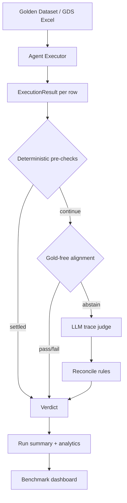

### Problem

Sirion’s contract-AI stack relies on **multi-step LLM agents** (Text2SQL, intelligent aggregation, intent routing, document upload, and more). Traditional unit tests miss what actually matters in production: tool-call trajectories, field routing against live metadata, valid refusals, HITL behavior, and whether the final answer matches user intent — often **without gold labels**.

Teams needed a way to benchmark agent changes, score regressions on golden datasets, and debug failures with enough trace context to act — not just pass/fail on final text.

### What I built

An **agentic evaluation platform** inside Sirion’s internal Auto-Eval stack (`talk-to-corpus` benchmarking):

- **Spec-driven evaluators** per agent type with a shared verdict model (`Passed` / `Failed` / `Inconclusive`, failure categories, confidence, dimension scores)
- **Hybrid judging pipeline**: deterministic pre-checks → gold-free structural alignment → LLM trace judge → post-hoc reconcile
- **Aggregation agent eval** with Sirion metadata (`apiName`, `chartSupported`), event-timeline context, and path-vs-outcome auditing
- **Text2SQL eval** with SQL field validation against metadata, keyword-routing skills, and reconcile rules for false `HALLUCINATED_FIELD` failures
- **Valid-refusal handling** — queries on non-chart fields or out-of-scope asks score as **Passed** (`NON_CHART_FIELD`, `OUT_OF_SCOPE`, `CANNOT_FULFILL`) instead of false `AGENT_ERROR`
- **GDS tooling** — generate benchmark datasets, tag use-case categories, and re-judge existing runs without re-executing the agent
- **React + FastAPI UI** — run history, pass-rate analytics, failure/pass category breakdowns, row inspector, human overrides, export, and **re-evaluate** action

### Evaluation flow

### Key design choices

| Layer | Approach |
|-------|----------|
| **Pre-checks** | Fast deterministic gates: timeouts, agent errors, exact gold match, hallucinated fields, empty outputs |
| **Gold-free mode** | Intent-spec extraction + structural alignment when no expected SQL/output exists |
| **Judge context** | Bounded trace packet: skills loaded, allowed field catalog, thinking steps, delegation timeline |
| **Reconcile** | Fix systematic false negatives (mapped fields, stale think steps vs correct output, debatable group-by) |
| **Re-evaluate** | Re-run judges on stored agent output so eval rule improvements don’t require costly agent reruns |

### Results / Impact

- Enabled **self-service regression benchmarking** for agentic workflows alongside 12+ classical ML pipelines in the same platform
- Improved aggregation benchmark signal quality: on a 122-row aggregation suite, **re-judging the same agent outputs** raised measured pass rate from **~7% → ~27%** after adding valid-refusal and alignment rules — surfacing real agent gaps vs eval noise
- Reduced false `AGENT_ERROR` / `WRONG_GROUPBY` failures on correct non-chart refusals (e.g. “Term & Renewal AE does not support chart-based grouping”)
- Gave PM/QA a inspectable dashboard: pass categories, evidence tier (gold / aligned / judge), per-row trace drawer, and exportable HTML/Excel reports

### Stack

Python · FastAPI · Pydantic · React · TypeScript · LLM-as-judge · YAML specs · Docker · Langfuse tracing · Excel GDS workflows
