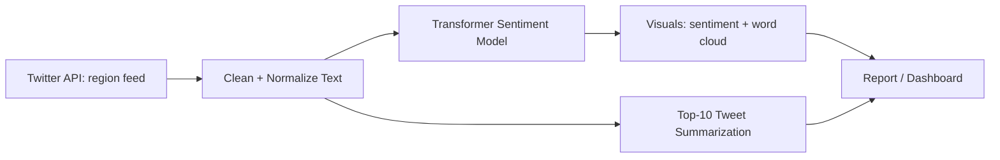

### Objective

Create a Python tool that ingests a region’s real-time Twitter feed and produces actionable summaries of what people are talking about.

### What I built

- Twitter ingestion via API + region filters
- Text cleaning + preprocessing pipeline
- Transformer-based sentiment model trained on Kaggle data
- Outputs: sentiment dashboard, word cloud, and “top 10 tweets” summarization using Hugging Face tooling

### Pipeline

### Results

- Achieved **0.96 validation ROC-AUC** on the sentiment model (Kaggle-based dataset).

